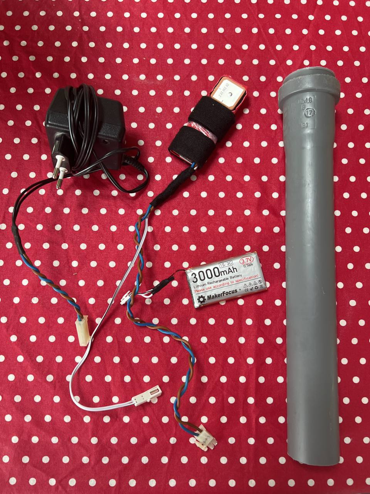
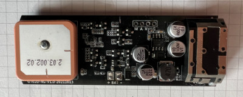
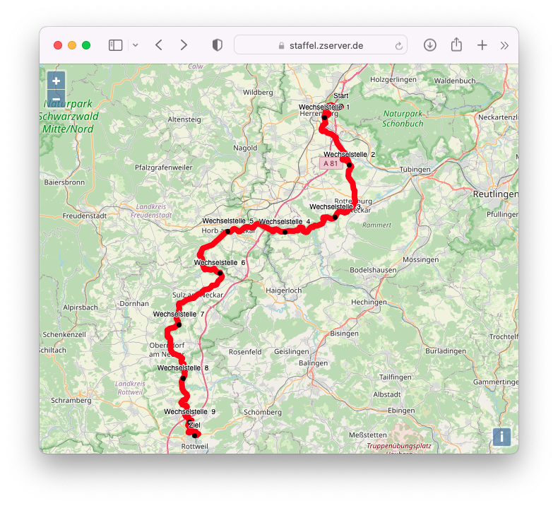

# E-Staffelstab


Projektdokukumentation zum E-Staffelstab, der beim "Staffelläufle 2022" zum Einsatz kam.



Bauteile:

- HT-Rohr, Durchmesser: 30 cm, Durchmesser: 40mm, mit Muffe
- Muffenstopfen für oben genanntes HT-Rohr
- GPS-Tracker
  Hier kam zum Einsatz: Sinotrack ST-901L 4G Mini GPS Tracker (https://www.amazon.de/gp/product/B09NCZMNNM/)
- großer Akku mit Steckverbinder, der den Pufferakku des Trackers ersetzt
  Hier kam zum Einsatz: Makerfocus 3.7V 3000mAh LiPo (https://www.makerfocus.com/products/makerfocus-3-7v-3000mah-lithium-rechargeable-battery-1s-3c-lipo-battery-pack-of-4)
- SIM-Karte mit Datenvolumen und der Möglichkeit zum SMS-Versand/Empfang
- Tesa-Baumwoll-Isolierband zur Polsterung der Platine im Gehäuse
- großer Schrumpfschlauch, um die Platine vor äußeren Einflüssen zu schützen

Hardware-Bau:



- Tracker aus Gehäuse ausbauen
- Kabel weg löten
- Pufferbatterie weg löten
- Kabel mit Buchse für den Weitbereichs-Spannungseingang an "V" und "G" anlöten
- Kabel mit Buchse für 3,7V-Akku an +/- Bat anlöten
- Schrumpfschlauch um Tracker anbringen
- GPS-Antenne freilegen
- An zwei Stellen mit Baumwollband so dick machen, dass Platine im Rohr hält

## Software

### Tracking-Server

Zum Verarbeiten der Ortungspunkte kam die Open-Source-Tracking-Lösung Traccar zum Einsatz.

https://www.traccar.org

Traccar wurde auf einer kleinen Ubuntu-VM bei Ionos installiert:

``` sh
wget https://github.com/traccar/traccar/releases/download/v4.15/traccar-linux-64-4.15.zip
unzip traccar-linux-64-4.15.zip
./traccar.run
systemctl enable traccar
systemctl start traccar
```

Da es sich um eine kleine Instanz mit vergleichsweise wenigen Zugriffen und nur einem getracktem Gegenstand handelte, wurden die Standarteinstellungen inklusive der eingebauten H2-Datenbank verwendet.

Traccar bietet je nach GPS-Tracker unterschiedliche Ports für die Datenannahme. Es muss identifiziert werden, welcher Port für den jeweiligen Tracker benötigt wird. Diese Port muss in der Servereigenen Firewall, sowie gegebenenfalls beim ISP geöffnet werden. Hier: H02-Protokoll auf 5013/TCP

Auf Traccar wird ein Device angelegt. Hierfür wird die Seriennummer/IMEI/... des Trackers benötigt. Wenn dann der Tracker aktiv ist, sollte seine Ortung im System angezeigt werden.

### Reverse Proxy

Nach der Installation ist Traccar für Benutzer per http auf Port 8082/TCP erreichbar. Um einen "normalen" Zugriff zu erhalten, empfiehlt sich ein Reverse Proxy. Hier umgesetzt mit Nginx und Certbot (Let's Encrypt-Zertifikat).

#### Entscheidende Konfiguration

```
  # Reverse Proxy von Traccar selbst:
  location / {
     proxy_set_header X-Forwarded-Host $host:$server_port;
     proxy_set_header X-Forwarded-Server $host;
     proxy_set_header X-Forwarded-For $proxy_add_x_forwarded_for;
      proxy_pass http://localhost:8082/;
  }

  # Reverse Proxy für Websockets/Live-Tracking
  location /api/socket {
     include proxy_params;
     proxy_http_version 1.1;
     proxy_cache_bypass $http_upgrade;
     proxy_buffering off;
     proxy_set_header Host $host;
     proxy_set_header Upgrade $http_upgrade;
     proxy_set_header Connection "Upgrade";
     proxy_pass http://localhost:8082/api/socket;
  }

  # Direktes Ausliefern der statischen Karten-Seite
  location /tsvlt {
     root /var/www/html;
  }
```

### Einrichten des Trackers

Je nach Tracker muss man IP-Adresse und Port des Traccar-Servers konfigurieren. Die Anleitung hierzu sollte dem Tracker beiliegen. Beim hier verwendeten geschah das über Steuerbefehle, die man per SMS senden musste.

Die Übertragungsfrequenz wurde auf einen Ortungspunkt alle 10 Sekunden - auch ohne aktives Zündsignal - gesetzt.

### Anzeige der Karte

Bei Traccar ist eine beispielhafte Kartendarstellung als Statische Webseite enthalten, welche den Websocket nutzt, um Geräte anzuzeigen. Dieses Beispiel von `/opt/traccar/web/simple' diente als Vorlage, um die eigene Kartenanzeige zu verwirklichen. Aufgrund der kurzen Zeit wurde die Seite so gestaltet, dass sie die Strecke aus dem GPS-Track und Wechselstellen anzeigt. Der Staffelstab wird als einziges getracktes Objekt angezeigt und die Karte zentriert bei jedem Update, welches über den Web Socket empfangen wird auf diesen Punkt.

Implementierung der Tracking-Seite: [tracking](./tracking/)

